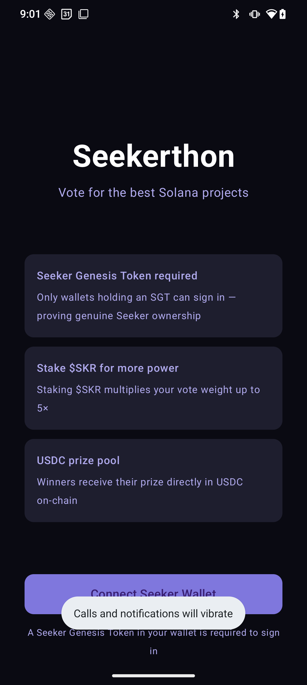
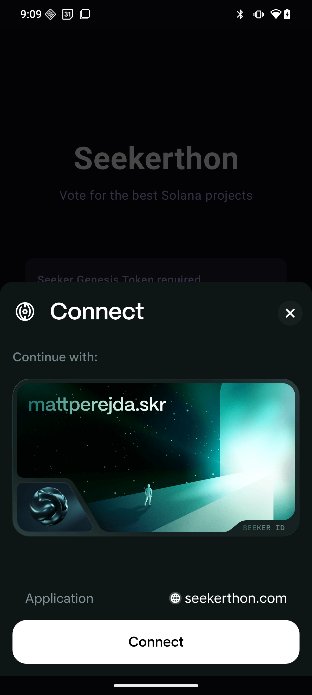
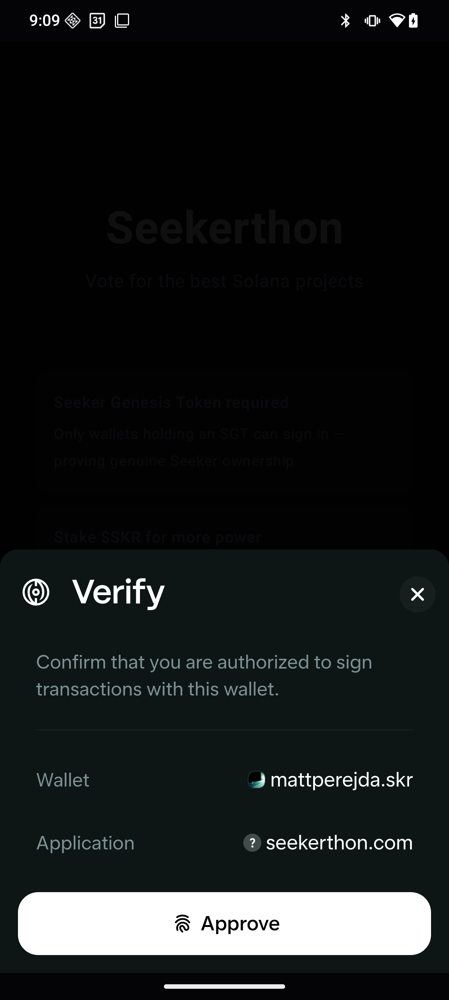
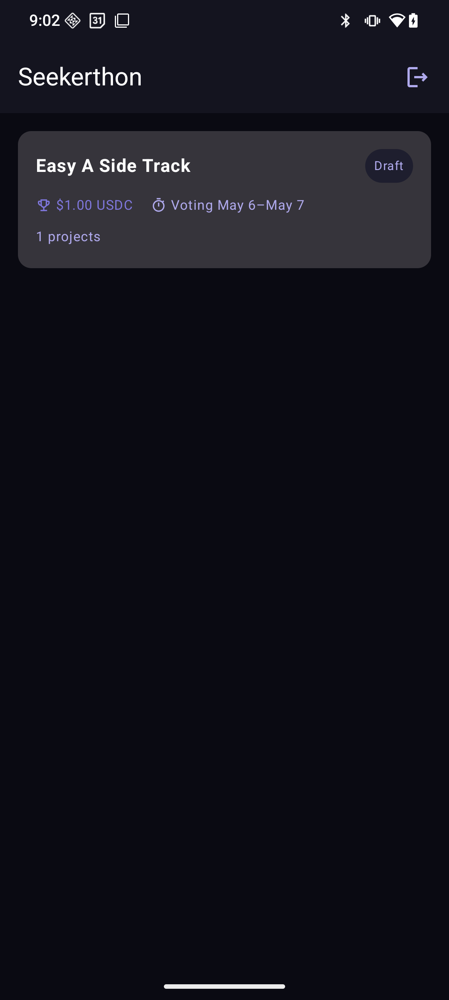
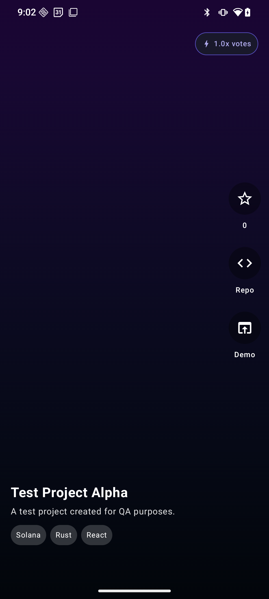

# Seeker Hackathon Platform

TikTok-style hackathon voting for Seeker users. Only Seeker Genesis NFT holders can vote. $SKR stakers get weighted votes (up to 5×). Prize pools are held in Solana escrow and released by the organizer after verifying winning teams' tech.

## Demo

| Web App | Mobile App |
|---------|------------|
| <a href="https://youtu.be/TxJNYVNTCuU" target="_blank"></a> | <a href="https://youtube.com/shorts/mUMq7XHoo6c?feature=share" target="_blank"></a> |

## Architecture

```
Android App (Kotlin + Jetpack Compose)
  └─ Seeker MWA SDK (wallet auth + Genesis NFT verification)
  └─ Retrofit → FastAPI backend

FastAPI Backend (Python)
  └─ Supabase Postgres (projects, votes, users)
  └─ Supabase Realtime (live vote counts)
  └─ Supabase Storage (demo videos, screenshots)
  └─ solders + anchorpy → Solana RPC

Solana Programs (Anchor / Rust)
  └─ voting: weighted votes, staking vault
  └─ escrow: prize pool lock + release

Web App (Next.js 14)
  └─ Organizer: create hackathon, verify tech, release prizes
  └─ Participant: submit project, upload assets
```

## Solana mobile app screens

| Login | Connect | Verify | Home | Test Project |
|-------|---------|--------|------|--------------|
|  |  |  |  |  |

## Solana Blockchain Integration

All trust-critical operations go on-chain on Solana. The backend never holds funds and never acts as a trusted intermediary for votes — it only builds transactions that the user signs with their own wallet.

### Wallet authentication
The app uses the [Seeker Mobile Wallet Adapter (MWA)](https://github.com/solana-mobile/mobile-wallet-adapter) to connect to the user's Seed Vault. Authentication is a challenge-response flow: the backend issues a random challenge, the user signs it with their private key inside Seed Vault, and the backend verifies the signature on-chain before issuing a JWT. No seed phrase or private key ever leaves the device.

### Genesis NFT gating
Before a vote transaction is built, the backend calls `verify_seeker_genesis_holder()` which queries the Solana mainnet RPC for all SPL Token and Token-2022 accounts owned by the wallet. For each NFT (balance = 1), it derives the Metaplex metadata PDA and reads the raw on-chain account data to confirm a verified collection entry matching the `SEEKER_GENESIS_COLLECTION` address. If no matching NFT is found the request is rejected with a `403`.

### Vote transactions
Votes are recorded both on-chain and in the database:
1. The backend builds an unsigned Solana transaction (`cast_vote` instruction targeting the voting program) and returns it base64-encoded to the app.
2. The app passes the transaction to Seed Vault via MWA for signing and broadcasting — the user's key signs it on-device.
3. The app submits the transaction signature to `/votes/confirm`. The backend calls `getTransaction` on the RPC to verify the transaction landed on-chain, the voter is a signer, and the correct program was invoked before writing the vote to the database.

### SKR token staking & vote weight
Vote weight is derived from the user's staked $SKR balance read directly from the on-chain staking vault PDA (`seeds = ["stake", wallet, mint]`). The weight is locked at prepare time so it cannot change between signing and confirmation.

```
weight = min(1 + log2(1 + staked_skr / 100), 5.0)
```

### Prize escrow
Prize pools are held in a USDC escrow PDA (`seeds = ["hackathon_escrow", hackathon_id]`) owned by the escrow program — not by the backend or organizer. Funds can only be released by calling the `release_prize` instruction, which the organizer signs via the web app after verifying the winning project's tech stack. The backend builds the release transaction; the organizer signs it.

## Seeker Genesis NFT Verification

The Android app connects via Seeker Mobile Wallet Adapter. When a user tries to vote, the backend (`/api/v1/votes/prepare`) calls `verify_seeker_genesis_holder()` which:

1. Fetches all SPL token accounts for the wallet
2. For each NFT (balance = 1), derives the Metaplex metadata PDA
3. Reads on-chain metadata and checks for a verified collection entry matching `SEEKER_GENESIS_COLLECTION`
4. Returns `403` if no Genesis NFT is found

Update `SEEKER_GENESIS_COLLECTION` in `.env` with the real collection mint address once you have it.

## Vote Weight Formula

```
weight = min(1 + log2(1 + staked_skr / 100), 5.0)
```

| $SKR Staked | Multiplier |
|-------------|-----------|
| 0           | 1.00×     |
| 100         | 2.00×     |
| 300         | 2.58×     |
| 700         | 3.17×     |
| 1,500       | 4.00×     |
| 3,100       | 5.00×     |

## Setup

### Prerequisites

- Python 3.11+
- Node.js 20+
- Android Studio Hedgehog+
- Rust + Solana CLI + Anchor CLI
- Supabase account
- Seeker phone (for mobile testing)

---

### 1. Supabase

1. Create a new Supabase project at https://supabase.com
2. Run the migration:
   ```
   supabase db push
   ```
   Or paste `supabase/migrations/001_initial_schema.sql` into the SQL editor.
3. Copy your project URL, anon key, and service role key.
4. Deploy the edge function:
   ```
   supabase functions deploy verify-webhook
   ```

---

### 2. Backend

```bash
cd backend
cp .env.example .env
# Fill in your Supabase credentials and Solana program IDs

python -m venv venv
source venv/bin/activate   # Windows: venv\Scripts\activate
pip install -r requirements.txt

#.\venv\Scripts\Activate.ps1
uvicorn app.main:app --reload
```

API will be at http://localhost:8000. Docs at http://localhost:8000/docs.

---

### 3. Solana Programs

```bash
cd solana
anchor build #cargo build-sbf work around
anchor deploy --provider.cluster devnet

# Copy the program IDs from the deploy output into backend/.env
```

After deploying, update `VOTING_PROGRAM_ID` and `ESCROW_PROGRAM_ID` in `.env`.

---

### 4. Web App

```bash
cd webapp
npm install
cp .env.local.example .env.local
# Set NEXT_PUBLIC_API_URL to your backend URL

npm run dev
```

Open http://localhost:3000.

---

### 5. Android App

1. Open `android/` in Android Studio
2. In `di/AppModule.kt`, update `BASE_URL` to your backend URL
3. Connect a Seeker-enabled Android device
4. Run → Deploy

The Seeker app must be installed on the device for wallet operations.

---

## Project structure

```
seeker-hackathon/
├── backend/
│   ├── app/
│   │   ├── main.py              FastAPI app
│   │   ├── config.py            Settings from .env
│   │   ├── db.py                Supabase client
│   │   ├── middleware/auth.py   JWT middleware
│   │   ├── models/schemas.py    Pydantic models
│   │   ├── routers/
│   │   │   ├── users.py         Wallet auth, genesis verify
│   │   │   ├── hackathons.py    CRUD + verify + leaderboard
│   │   │   ├── projects.py      Submit + upload assets
│   │   │   └── votes.py         Prepare tx + confirm on-chain
│   │   └── services/
│   │       └── solana_service.py  SKR balance, vote tx, NFT check
│   └── requirements.txt
│
├── android/
│   └── app/src/main/java/com/seeker/hackathon/
│       ├── MainActivity.kt
│       ├── SeekerApp.kt
│       ├── data/
│       │   ├── remote/SeekerApi.kt      Retrofit interface + DTOs
│       │   └── repository/WalletRepository.kt  MWA auth + tx signing
│       ├── domain/model/Models.kt
│       ├── di/                          Hilt modules
│       ├── ui/
│       │   ├── AppNavGraph.kt
│       │   ├── screens/feed/            TikTok voting feed
│       │   ├── screens/login/           Wallet connect
│       │   └── screens/hackathons/      Hackathon list
│       └── util/Mappers.kt
│
├── webapp/
│   └── src/app/
│       ├── hackathons/create/page.tsx   Create hackathon form
│       ├── projects/submit/[id]/page.tsx  Submit project
│       └── dashboard/[id]/page.tsx      Organizer verify + release
│
├── solana/
│   ├── programs/
│   │   ├── voting/src/lib.rs            Weighted votes + staking vault
│   │   └── escrow/src/lib.rs            Prize escrow + release
│   └── Anchor.toml
│
└── supabase/
    ├── migrations/001_initial_schema.sql
    └── functions/verify-webhook/index.ts
```

## Key flows

**Login (Android)**
1. App calls Seeker MWA → user authorizes
2. App fetches `/users/challenge` with wallet address
3. App signs challenge via Seeker SDK
4. App POSTs signed challenge → receives JWT
5. JWT stored in DataStore, added to all API requests

**Voting (Android)**
1. User swipes feed, taps star on a project
2. App checks `isSeekerVerified` (set at login)
3. App calls `POST /votes/prepare` → backend verifies Genesis NFT on-chain
4. Backend returns unsigned Solana transaction (base64)
5. App sends tx to Seeker SDK for signing + broadcasting
6. App calls `POST /votes/confirm` with tx signature
7. Backend verifies tx on-chain, writes to Supabase
8. Realtime subscription updates vote count on all clients

**Prize release (Web)**
1. Organizer reviews leaderboard on dashboard
2. Organizer clicks "Verify & Release Prize" on winning project
3. Backend marks project as winner, hackathon as completed
4. Edge function fires push notification to voters
5. (Production) Backend calls Solana escrow program to release funds
